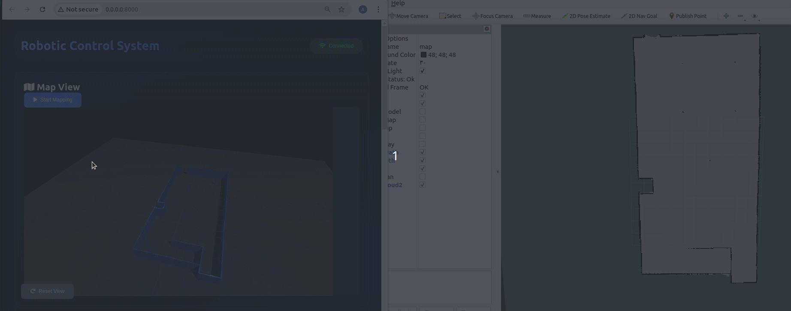

# ros-3dmap-visualization

Map3D is a powerful JavaScript Class that enables real-time 3D visualization of ROS 2D occupancy grid maps in web applications. It provides an easy-to-use interface for converting 2D map data into interactive 3D environments with customizable visualization options.
## Demo



## Features

- Real-time conversion of ROS occupancy grid maps to 3D visualization
- Interactive camera controls with orbital movement
- Dynamic lighting system with ambient, hemisphere, directional, and point lights
- Customizable wall heights and cell sizes
- Shadow mapping support
- Responsive design support
- Built-in grid system for reference

## Dependencies

- Three.js (r128 or later)
- ROSlib.js
- Three.js OrbitControls

## Installation

1. Include the required dependencies in your HTML file:

```html
<script src="https://cdnjs.cloudflare.com/ajax/libs/three.js/r128/three.min.js"></script>
<script src="https://cdn.jsdelivr.net/npm/three@0.128.0/examples/js/controls/OrbitControls.js"></script>
<script src="./js/roslib.js"></script>
<script src="./js/map3d.js"></script>
```

2. Create a container element in your HTML:

```html
<div id="map" class="map-canvas"></div>
```

## Usage

### Basic Implementation

```javascript
// Initialize the Map3D viewer
const map3dViewer = new Map3DViewer('map', {
    width: 800,
    height: 600,
    wallHeight: 1.5,
    cellSize: 0.05
});

// Subscribe to ROS map topic
const mapTopic = new ROSLIB.Topic({
    ros: rosConnection,  // Your ROS connection instance
    name: '/map',
    messageType: 'nav_msgs/OccupancyGrid'
});

// Update the 3D map when new map data is received
mapTopic.subscribe((message) => {
    map3dViewer.updateMap(message);
});
```

### Configuration Options

The Map3DViewer constructor accepts the following options:

```javascript
{
    width: 800,          // Width of the viewer in pixels
    height: 600,         // Height of the viewer in pixels
    gridSize: 20,        // Size of the reference grid
    cellSize: 0.05,      // Size of each cell in meters
    wallHeight: 2        // Height of the walls in meters
}
```

### Styling

Add these CSS styles to ensure proper display:

```css
.map-canvas {
    width: 100%;
    height: 100%;
    aspect-ratio: 16/9;
    background: rgba(51, 65, 85, 0.3);
    border-radius: 0.75rem;
    overflow: hidden;
    position: relative;
}
```

## Advanced Features

### Camera Control

The viewer includes OrbitControls for interactive camera movement:
- Left mouse button: Rotate
- Right mouse button: Pan
- Mouse wheel: Zoom

### Lighting System

The 3D environment includes multiple light sources:
- Ambient light for base illumination
- Hemisphere light for sky/ground color variation
- Directional light with shadows
- Two point lights for additional depth

### Map Updates

The viewer automatically handles map updates through the `updateMap` method:

```javascript
map3dViewer.updateMap(occupancyGridMessage);
```

This method:
- Removes existing map geometry
- Creates new wall geometries based on occupancy data
- Applies materials with physical properties
- Updates shadows and lighting

## Customization

### Changing Materials

You can customize the appearance of walls by modifying the material properties:

```javascript
const wallMaterial = new THREE.MeshPhysicalMaterial({
    color: 0x4488ff,
    transparent: true,
    opacity: 0.9,
    metalness: 0.5,
    roughness: 0.3,
    clearcoat: 0.1
});
```

### Resizing the Viewer

To handle window resizing:

```javascript
window.addEventListener('resize', () => {
    map3dViewer.setSize(newWidth, newHeight);
});
```

